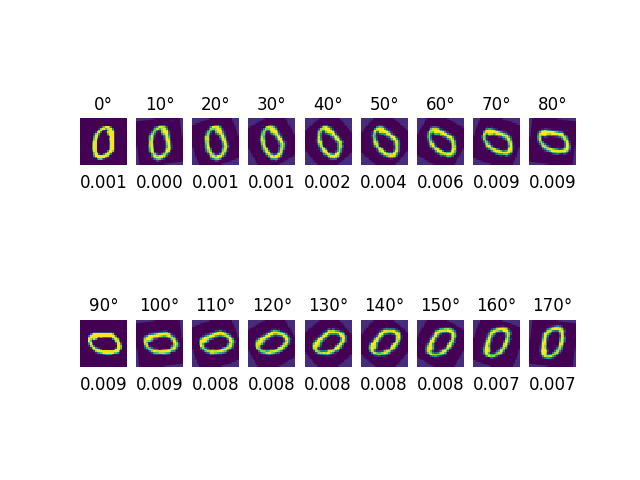
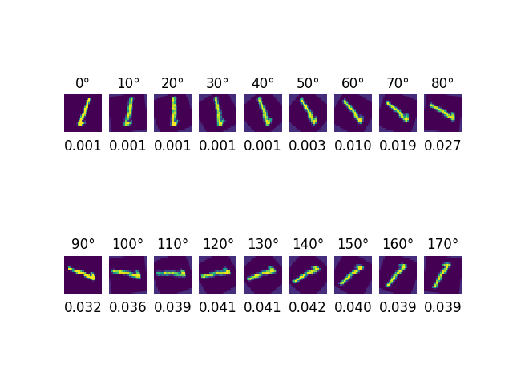
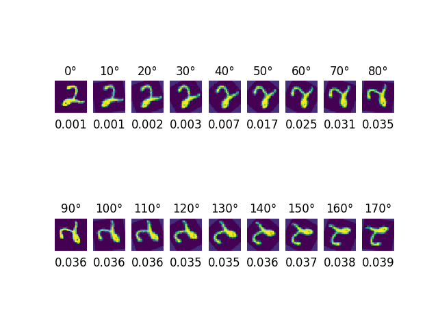
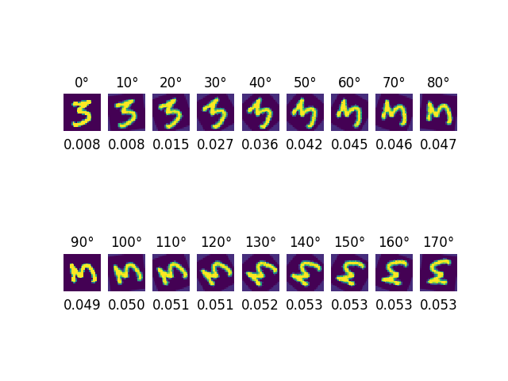
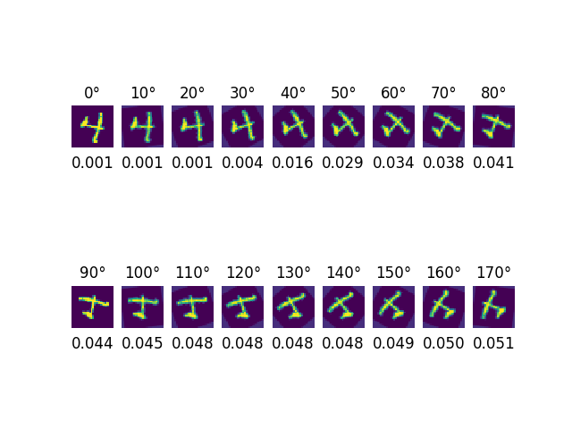
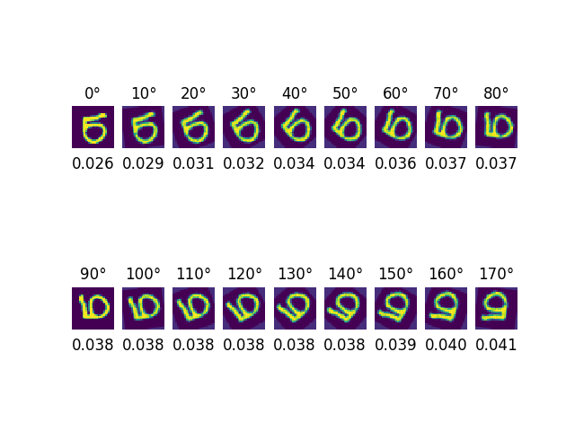
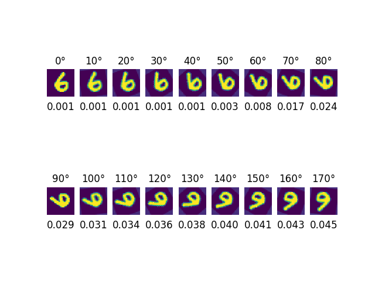
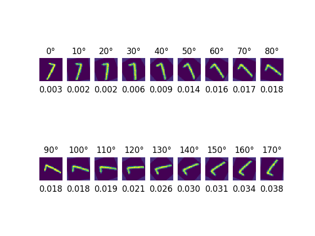
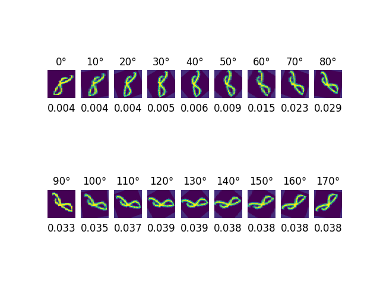
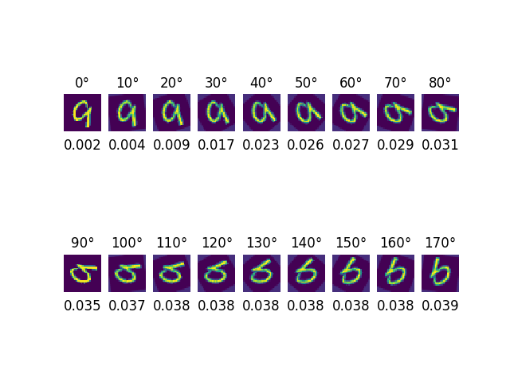

# Uncertainty_Mnist
Uncertainty estimation on Mnist dataset

This is a PyTorch implementation of Dropout Uncertainty on Mnist. The experiment setting is based on [Dropout as a Bayesian Approximation: Representing Model Uncertainty in Deep Learning](https://arxiv.org/pdf/1506.02142.pdf) at 5.2 Model Uncertainty in Classification Tasks.

## Installation 

1. Install Pytorch
[Pytorch](http://pytorch.org/)
```
conda install pytorch torchvision -c pytorch
```
2. Clone this repository 
```
git clone https://github.com/andyhahaha/Uncertainty_Mnist
```

## Usage 

1. Train Lenet standard and Lenet dropout
```
python main.py --mode 0
```

2. Test Lenet standard and Lenet dropout
```
python main.py --mode 1
```

3. Test the Lenet dropout on rotated Mnist image 
```
python main.py --mode 2
```

## Result
These result show the uncertainty of different rotated digits.

<table>
  <tr>
    <td>0</td>
    <td>1</td>

  </tr>
  <tr>
    <td></td>
    <td></td>

  </tr>
  <tr>
    <td>2</td>
    <td>3</td>

  </tr>
  <tr>
    <td></td>
    <td></td>
  </tr>
  
  <tr>
    <td>4</td>
    <td>5</td>

  </tr>
  <tr>
    <td></td>
    <td></td>
  </tr>
  
  <tr>
    <td>6</td>
    <td>7</td>

  </tr>
  <tr>
    <td></td>
    <td></td>
  </tr>
  
  <tr>
    <td>8</td>
    <td>9</td>

  </tr>
  <tr>
    <td></td>
    <td></td>
  </tr>
 
</table>
